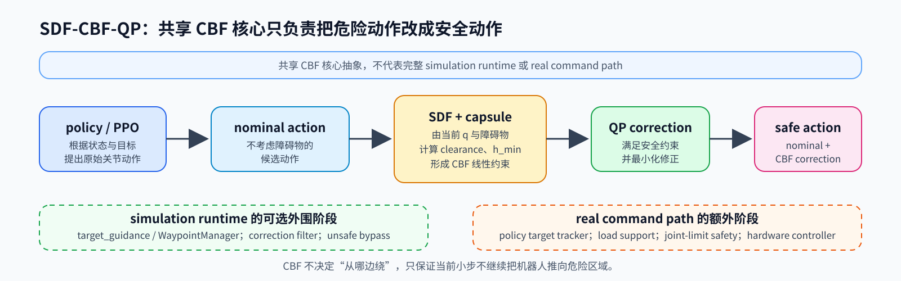
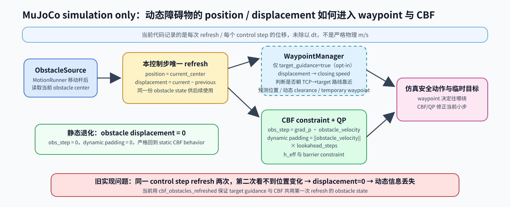
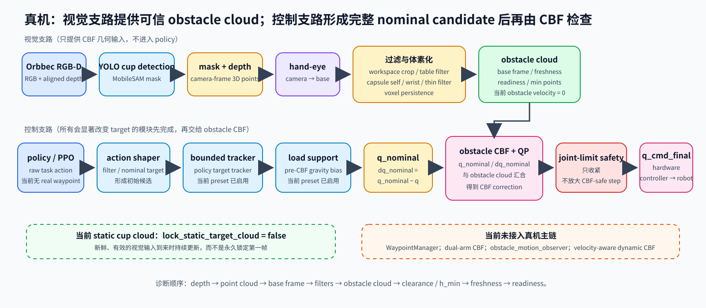

# SDF-CBF-QP 避障与动态障碍完整说明

## 这套系统解决什么问题

这套系统的基础分工很简单：policy 或 PPO 决定“我想怎样去目标”，CBF-QP 决定“这一步照着走会不会撞；如果会，至少要改多少”。控制链可以概括为：

```text
policy / PPO
  → nominal joint action
  → SDF 几何距离与 CBF 安全判断
  → QP 求最小安全修正
  → final action
```



**nominal action** 是不考虑障碍物时 policy 原本要给机械臂的关节动作。CBF（Control Barrier Function，控制屏障函数）不是路径规划器，不会自己设计一条完整绕行路线；它只在当前控制帧检查 nominal action 会不会继续把机器人推向危险区域。QP（quadratic program，二次规划）则是在满足安全条件和关节边界的前提下，求一个尽量小的修正。

这份文档把项目早期的单臂静态 SDF-CBF-QP、后续仿真扩展、动态障碍评测、真机视觉迁移与几何诊断放在同一条主线上说明。文中“当前实现”只指当前 HEAD 已合入代码；历史实验和未来方向会单独标出，避免把旧日志或实验代码误写成当前真机能力。

沿着这条原始链路，后续工作并不是另起炉灶，而是补上三个原来缺失的环节。避障 QP 不再只追求“关节改得最少”，也尽量不把夹爪推离任务方向；目标被杆挡住时，policy 不再只能直冲真实目标，而会临时看向一个绕行 waypoint；动态障碍的数据则从“视觉上在动、CBF 却常收到零速度”的断链状态修到同一控制步共用位置和速度。它们分别处理“怎么改动作”“该往哪里绕”和“障碍物是否正靠近”三个不同问题。

## 原始单臂静态 SDF-CBF-QP 是怎么工作的

早期逻辑面向单臂和静态障碍。机械臂不会只用 TCP 一个点做碰撞判断，而是把各段连杆近似成 capsule，并保留少量普通监视点。**capsule** 可以把它理解成两端圆、中间圆柱的胶囊形包络：它不追求精确还原每一颗螺丝，却能用很低的计算成本覆盖一整段连杆。

障碍物可以是解析几何，也可以来自点云。SDF（signed distance field，带方向的距离场近似）负责回答两个问题：某个空间查询点离障碍物表面多远，以及朝哪个方向移动会远离障碍。对当前关节状态 `q` 做正向运动学（FK）后，系统得到 capsule/监视点在世界中的位置；再查询到障碍物的距离和梯度。

**clearance** 是机器人胶囊表面到障碍物表面的几何间隙。系统从它扣除安全距离、胶囊半径和必要的点云膨胀后，得到 barrier `h`。`h > 0` 代表还有安全余量，`h = 0` 落在安全边界，`h < 0` 表示进入了安全缓冲区。所有监视位置里最小的那个值叫 **h_min**；它是当前最危险位置的摘要，不是 TCP 到目标的距离。

下一步看 nominal action 会怎样改变 `h`。如果某个动作会让 `h` 更小，CBF 就把“不能继续这样靠近”写成一条线性不等式。QP 收集这些约束，在关节动作上下界内求 correction：

```text
final action = nominal action + CBF correction
```

因此，CBF 不替 policy 选任务目标，也不替代控制器；它只是确保 final action 比 nominal action 更符合当前几何安全条件。静态障碍只需要知道“它在哪里”。动态障碍还要知道“它正在往哪边走”，这是后续扩展的起点。

## 9 点与 17 点：先把距离量准

一条 capsule 不能只查中心点，因为最近位置可能落在两端之间。当前单臂模型以 7 条 capsule 和 5 个普通监视点查询障碍物。每个障碍物的查询数量约为：

```text
9 点：  7 × 9  + 5 = 68
17 点： 7 × 17 + 5 = 124
```

17 点的意义是让 capsule 上的距离查询更密，约为 9 点的 1.82 倍。它主要增加几何距离计算成本，不等于 QP constraint 数直接乘以 17/9：当前单臂流程会先在一条 capsule 上找最危险的 barrier/clearance，再把结果整理成约束。

共享库和当前真机保持 9 点，这是为了兼容已经运行过的单臂静态链路并控制计算量。仿真增强入口显式选择 17 点，用于更细地观察连杆附近的几何误差。两者由 `capsule_sample_count` 或 `--cbf-capsule-samples` 明确配置，不能根据调用目录自动改变。

## QP 为什么后来要关心 TCP 任务

早期 QP 使用 `H = I`，它表达的是“安全前提下，关节动作改得越少越好”。这通常合理，但关节改动最小并不总意味着任务方向最好。例如两个修正都能躲开障碍，一个让关节改动很少却把夹爪甩离目标，另一个关节变化稍大但 TCP 仍大致沿目标方向推进；单纯 `H = I` 不会优先后者。

TCP 是夹爪真正执行任务的位置。仿真增强模式加入 task-preserving metric：

```text
H = I + task_preserve_weight · J_tcp^T J_tcp
```

它利用 TCP Jacobian，让 QP 在满足安全约束时额外减少对 TCP 任务方向的扰动。**task-preserving** 的意思不是“忽略安全继续追目标”，而是在同样安全的可选修正里，更偏向保留末端任务意图。

`task_preserve_weight` 只控制这项 Hessian 权重。它与 `lambda_cbf`、`gamma` 不同：后两者属于 barrier 收敛/增益语义，不能混作 TCP 权重。共享默认仍是 `identity`；只有仿真入口显式设置 `qp_metric=task_preserving` 才使用这项代价。`I` 仍在公式中，因此 Hessian 保持正定。求解不可行时会走已有的投影回退，但回退只避免求解器直接失败，不等于已经完成所有动力学验证。

## 为什么 CBF 安全却仍可能停住

如果目标在障碍杆后面，policy 会一直尝试直线向目标走，CBF 每帧又把向杆靠近的成分削掉。结果可能安全，却停在障碍物前反复拉扯。原因不是 CBF 算错，而是 CBF 本来只负责“这一小步安全不安全”，不负责回答“应该从左还是从右绕”。

WaypointManager 是仿真 runtime 中的补充。它先看 TCP 到真实 target 的任务路径是否被障碍物挡住：没挡住就继续追真实目标；挡住时，生成障碍物两侧的临时 waypoint，比较绕行代价后暂时选一侧；绕过后再取消 waypoint，回到真实 target。

三者职责不要混淆：waypoint 决定“往哪里绕”，policy 决定“怎样朝当前目标走”，CBF 决定“当前这一小步是否安全”。当前共享默认 `target_guidance=false`，导入 runtime 或构造普通配置不会自动启用 waypoint；仿真增强入口才显式开启。当前真机 `policy_reach_node.py` 不接入这套 simulation WaypointManager。

## 从静态障碍到动态障碍

动态障碍难在“当前距离”不够说明危险程度。距离还远的杆可能正在快速靠近；距离很近的杆也可能正在离开。为此，动态扩展把相邻帧位置变化整理为 obstacle velocity，并关心 **closing speed**：也就是障碍物相对机器人沿接近方向的速度分量。只有它表示正在靠近时，更早留出余量才有意义。

**dynamic lookahead** 是按 obstacle velocity 往未来看若干离散控制步；对应的 dynamic padding 会从有效 barrier 中额外扣除预测余量。当前实现的核心形式是：

```text
h_eff = h - dynamic_obstacle_lookahead_steps × obstacle_speed
```

所以 obstacle velocity 为零时，dynamic padding 自动是零，静态障碍会退化回原有逻辑。它不是“只要障碍物在动就无限扩大安全距离”。仿真的 target guidance 还会根据速度和 closing speed 判断是否使用更大的临时 clearance、是否让 waypoint 略向真实目标前移；障碍物正在远离时，不应仅因为它有速度就做大幅绕行。

换句话说，调用共享 CBF 时不需要靠“静态模式”和“动态模式”两套隐藏分支来切换：位置有更新、速度非零且 lookahead 被显式设置时，预测余量才出现；障碍物静止或速度为零时，它自然退化为静态 CBF。仿真入口仍把 lookahead 写成显式默认值，是为了让实验设置可见、可复现，而不是悄悄改变真机默认。

### 动态信息曾经为什么没有真正传到 CBF

历史上，同一个 control step 内的障碍物可能被刷新两次。第一次刷新已经能由“当前位置减上一帧位置”得到速度；第二次位置没有变化，又会得到零速度并覆盖第一次结果。表面上障碍物正在运动，最后 CBF 却可能拿到 zero velocity。

当前 `ReachStepper.compute_targets()` 通过一次控制步内的 `cbf_obstacles_refreshed` 状态避免重复刷新。若本帧需要刷新，target guidance 和 `solve_cbf_correction()` 复用同一份 obstacle position/velocity；若已经刷新，就不再用同一姿态重置速度。这是仿真动态信息能贯通到 waypoint 和 CBF 的必要条件。它不代表真机已经有速度观测：当前 real policy 仍把障碍速度视为零。



## 三层配置边界

共享模块同时服务仿真和真机，因此新行为必须是显式接口，不能偷偷改共享默认。

| 场景 | 当前配置 | 含义 |
|---|---|---|
| Shared conservative defaults | samples 9、`identity`、guidance false、lookahead 0、unsafe bypass false | 保持旧单臂静态行为。 |
| Simulation enhanced entrypoints | samples 17、`task_preserving`、`task_preserve_weight=5.0`、guidance/filter/bypass true | 用于 demo、动态实验和 evaluator。 |
| Dynamic simulation | lookahead 2.0 | `play.py`、`eval_sdf_challenge.py`、`vision_preview.py` 面向运动障碍。 |
| Static evaluators | lookahead 0.0 | `eval_cbf.py`、`eval_random_rod_sdf.py` 默认不引入预测余量。 |
| Real policy | samples 9、`identity`、单臂、静态 cup、障碍速度 0、lookahead 0 | 当前真机稳定边界。 |

仿真运动默认 `none`，只有显式选择才会启动。当前已正式合入的随机模式是 `random`、`random_depart` 和 `random_depart_probe`；它们不进入真机控制链。

## MuJoCo 动态障碍、评测与复现

仿真需要可重复的动态障碍，否则同一个算法在不同随机轨迹上比较没有意义。`MotionSpec` 描述运动参数，`MotionRunner` 在仿真里执行它。`random` 由 seed 产生可复现随机轨迹；`random_depart` 先在工作区内运动，再平滑移到让路位置；`random_depart_probe` 在 TCP 接近目标后回探，适合观察接近阶段的交互。相同 motion seed、振幅、周期和其他运动参数会生成相同轨迹。

`--obstacle-can-fall` 适合查看碰撞后的物理画面，但严格比较通常应让杆保持直立；否则一旦倒杆，后续场景已经不再是同一条预设轨迹。

除随机模式外，`MotionRunner` 也保留了 `circle` 和 `line` 这类受控轨迹，便于把障碍物速度和几何位置固定下来排查问题。`random_depart` 适合观察障碍物先占据工作区、再让出路径时的反应；`random_depart_probe` 会在 TCP 接近目标后回探，触发时刻依赖实际接近过程，因此适合展示交互，不适合作为唯一的严格百分比比较场景。需要保留单局轨迹时可使用 `--cbf-log` 与 `--traj-log`，输出应放在 `logs/`，而不是混入源码或评测结论。

### 评测入口和指标

`mujoco/eval_cbf.py` 面向固定杆静态评测，`mujoco/eval_random_rod_sdf.py` 面向多轮随机杆静态评测，`mujoco/eval_sdf_challenge.py` 面向动态 challenge。动态 evaluator 先从 target bank 中挑选困难 target，再在相同 target 顺序和障碍轨迹下比较 `none`、`geom` 等方法。

结果不能只看有没有碰撞。`contact_rate` 是碰到障碍的局比例，`no_contact_rate` 是其互补指标；`reach_2cm_rate` 表示曾进入目标 2 cm；safe reach 同时要求到达和未碰撞。`mean_best_dist_m`、`mean_end_dist_m` 分别表示过程最接近目标和结束时的平均距离，`h_min` 反映安全余量，correction magnitude 反映安全层改动作的幅度，`mean_max_obs_speed` 用于确认动态障碍确实产生了运动。安全但始终停住，不是完整的任务解决。

`--seed` 控制 target 扫描/选择，`--obstacle-motion-seed` 控制障碍轨迹。比较两组配置时，两者都应固定。evaluator 写出的 `challenge_indices.json` 可由 `play.py --target-indices-file` 重放 target 顺序，但仍要同时复用 motion、seed、振幅、周期和关键 CBF 参数。

### sweep 工具

`scripts/sweep_dynamic_obstacles.py` 通过 subprocess 调用 `mujoco/eval_sdf_challenge.py`，批量扫描 motion、obstacle seed、amplitude 和 period。当前默认是两种 motion（`random`、`random_depart`）乘四个 obstacle seed（42、43、44、45），共 8 个 scenario。每个 scenario 读取 evaluator 的 `summary.json`，再汇总为 `sweep_summary.csv` 与 `sweep_summary.md`，默认输出到 `logs/eval/dynamic_obstacle_sweep/`。

`--skip-existing` 默认开启，已有 `summary.json` 的场景会跳过；`--no-skip-existing` 可强制重跑。脚本没有 `--trials` 参数，需要重复实验时应明确提供多个 `--obstacle-seeds`。`logs/` 是运行产物目录，已被 Git 忽略。

### 常用命令

以下命令是当前 CLI 的用法示例，运行前需要具备可导入 MuJoCo、模型和 policy 的 Python 环境：

```bash
REPO_ROOT="$(git rev-parse --show-toplevel)"
cd "$REPO_ROOT"

python mujoco/play.py \
  --episodes 1 --enable-cbf --target-idx 1729 \
  --cbf-capsule-samples 17 \
  --cbf-qp-metric task_preserving \
  --cbf-task-preserve-weight 5.0 \
  --cbf-target-guidance \
  --cbf-correction-filter \
  --cbf-bypass-filter-when-unsafe \
  --obstacle-motion random_depart \
  --obstacle-motion-seed 42 \
  --cbf-dynamic-lookahead-steps 2.0
```

若要复现带明确让路参数的单局 demo，可以完整执行：

```bash
python mujoco/play.py \
  --episodes 1 --enable-cbf --target-idx 1729 \
  --cbf-capsule-samples 17 \
  --cbf-qp-metric task_preserving \
  --cbf-task-preserve-weight 5.0 \
  --cbf-target-guidance --cbf-correction-filter \
  --cbf-bypass-filter-when-unsafe \
  --cbf-dynamic-lookahead-steps 2.0 \
  --obstacle-motion random_depart \
  --obstacle-motion-center 0.25,0.075,0.02 \
  --obstacle-motion-amp 0.035,0.05,0.00 \
  --obstacle-motion-period 1.0 \
  --obstacle-motion-seed 42 \
  --obstacle-motion-active-time 2.0 \
  --obstacle-motion-clear-offset 0.18,-0.12,0.00 \
  --obstacle-motion-clear-time 2.0
```

要运行回探模式，将 motion 改为 `random_depart_probe`，并显式给出如 `--obstacle-motion-probe-trigger-distance 0.06` 与 `--obstacle-motion-probe-offset=-0.07,0.05,-0.15` 的参数。这样别人能看出“何时回探”来自什么条件，而不会把随机 viewer 画面当作固定场景。

```bash
python mujoco/eval_cbf.py \
  --num-episodes 32 --seed 42 \
  --cbf-capsule-samples 17 \
  --cbf-qp-metric task_preserving \
  --cbf-task-preserve-weight 5.0 \
  --out-dir logs/eval/static_example

python mujoco/eval_sdf_challenge.py \
  --out-dir logs/eval/dynamic_example \
  --seed 42 --scan-count 64 --max-challenges 16 \
  --methods none geom \
  --obstacle-motion random_depart \
  --obstacle-motion-seed 43 \
  --workspace-sdf-preset dynamic

python scripts/sweep_dynamic_obstacles.py \
  --out-root logs/eval/dynamic_obstacle_sweep \
  --obstacle-seeds 42,43,44,45 \
  --motions random,random_depart \
  --amps 0.02,0.02,0.00 --periods 1.0
```

多组振幅用分号分隔：`--amps '0.01,0.01,0.00;0.02,0.02,0.00'`。单局 viewer、静态检查或某一次 sweep 都不能替代完整物理回归。

## 历史阶段性实验结果

仓库的本地 `logs/eval` 中保留了历史 summary。它们记录的是当时的 checkpoint、MJCF、参数和代码版本，不是当前 HEAD 的重新复跑 benchmark，且部分元数据仍带历史机器路径。因此这些数字用于说明“当时观察到了什么”，不用于统计显著性结论，更不能替代本次提交后的完整物理回归。

静态固定杆有两组可直接核对的 32-target 记录。早期 `lam5_g16` summary 中，基线无接触率是 68.8%，CBF 是 87.5%，相当于提高 18.8 个百分点；该组 CBF 的 safe reach@2cm 是 62.5%。后续 `guided-default` summary 仍以同一基线 68.8% 为参照，记录的 CBF 无接触率是 96.9%、safe reach@2cm 是 65.6%，即相对无 CBF 基线高 28.1 个百分点。这两组都说明静态杆上安全性曾提升，但它们处在不同阶段，不能被写成“只改一个参数”的严格 A/B。

动态难例也保留了能配对的 16-target 历史 summary：`dynamic_aware_default_16` 的无接触率为 43.8%、到达 2 cm 为 18.8%、平均最佳距离为 61.7 mm；同样采用 line motion、相同 target 数与运动幅度/周期的 `closing_aware_dynamic_16_thresh5e5` 记录为 50.0%、25.0% 与 60.4 mm。这个阶段性比较说明速度/closing-aware 调整至少没有只把机器人完全停住，并观察到安全和接近目标的改善；样本仍只有 16，不能据此宣称动态问题已经解决。

旧工作记录里还出现过“43.8% → 50.0%、18.8% → 31.2%、70.6 mm → 60.3 mm”这一组数字。仓库中没有找到能证明三项同时来自同一 target 列表、同一 motion 和同一参数的完整配对 summary，因此保留为待追溯的历史笔记，不纳入上面的可核对对比。之后报告任何动态提升时，应一并保存 `challenge_indices.json`、两个 seed、motion 参数、checkpoint、代码 commit 和原始 `summary.json`。

## 从 MuJoCo 到真机：问题从几何开始

MuJoCo 直接知道障碍物几何；真机没有这个便利。当前静态杯子链路需要先把视觉结果变成与机器人 FK 相同坐标系中的 obstacle cloud：

```text
Orbbec RGB-D
  → fixed YOLO 检测 cup
  → MobileSAM 生成 mask
  → mask 与 depth 生成 camera-frame 3D 点
  → hand-eye 转到 robot base frame
  → obstacle_cloud_node.py 发布 obstacle cloud
  → policy_reach_node.py 生成 nominal command
  → obstacle CBF 修正
  → hardware controller
```



`run_policy_reach.sh` 当前以 `fixed_yolo_sam` 启动 `target_segmenter_node.py`，并以 `obstacle_cloud_node.py` 生成障碍点云。杯子的真实位置来自这条视觉链；`--relative-delta` 只是 reach target 相对当前 TCP 的位移，不是杯子位置。

### hand-eye、base frame 与安全余量

只有把 cup cloud 和 FK 得到的 link/TCP 都放进 robot base 坐标系，clearance 和 `h_min` 才有实际意义。当前 `real_camera_calib.json` 以 `orbbec_eye_to_hand_current.json` 为来源，并明确 optical frame 到后端挂载坐标的轴向转换。

当前标定 metadata 记录 Park 方法、筛选后 26 个样本、固定板在夹爪坐标中的 translation RMS 约 19.96 mm、rotation RMS 约 5.57°，以及平均 PnP reprojection RMS 约 0.246 px。这是当前阶段标定结果，不是“物理标定完全准确”的证明。真机安全余量还要覆盖 hand-eye 误差、depth 噪声、机器人外壳几何误差和舵机响应延迟。

配置文件内部也做过一致性检查：`T_parent_cam @ diag(1,-1,-1,1)` 与 `source_handeye` 中保存的 `T_base_camera.matrix` 当前逐元素一致，旋转部分行列式接近 1。这只能排除这两份配置之间的坐标转换写法不一致，不能替代现场标定精度验证。历史日志中曾记录 camera-frame cup centroid `(0.022370,-0.002766,0.385000)m` 转到 base 后约为 `(0.267982,0.176849,0.159415)m`，并与另一份 cloud bbox `[(0.215,0.123,0.055),(0.314,0.221,0.201)]m` 在位置量级上相容；两者不是同一帧，不能据此宣称现场已验证 2–3 cm clearance。

### static cloud 与 persistence 的历史问题

代码支持把静态点云锁住：`lock_static_target_cloud=true` 时，满足条件的一份 cloud 会被保留并以心跳继续发布。这在真正固定的标定场景可避免点云抖动，但若杯子已经移动，继续使用第一帧 cloud 就会让 CBF 对旧位置做正确计算、对当前位置做错误判断。

当前 `run_policy_reach.sh` 和几何诊断 launcher 都显式传 `lock_static_target_cloud=false`。这里的 `static` 表示默认不主动模拟障碍运动，不表示“永远只用第一帧 cup cloud”；只要新视觉输入有效，obstacle cloud 会继续更新。

视觉链是异步的，mask、depth 和分割结果会短暂不同步。默认 node 的 `persistence_hits` 是 2，但当前 production launcher 在 `static + target_only` 条件下显式设为 1：否则偶发 stale mask 可能让下一帧有效 depth 被当成重新开始累计，造成 raw cup cloud 很密却发布空 persistent cloud。这个选择是针对异步数据链的工程折中，不代表降低 persistence 在所有场景都更安全；仍需依赖 freshness、点数和 failsafe 检查。

另一个容易被误判的问题是旧版 `PointCloudSdfObstacle` 的 0.15 m 搜索半径：超过半径时，旧分支会直接返回 `h=0.15` 和零梯度，而正常分支应从中心到点云的距离中扣除 capsule radius、inflate 和 `d_safe`。因此旧日志里的 `h=0.15` 不是 clearance。当前诊断和生产 barrier 使用未截断最近邻查询；这项修正针对真机点云距离，不改变共享仿真的 CBF 算法、安全距离、激活阈值或 hard stop 定义。

## 真机 command path：CBF 检查的必须接近最终命令

真实机械臂还有 tracker、滤波、负载补偿和关节限位。它们解决的是静摩擦、dead zone、量化、重力/肩部负载和硬件边界，不能简单删除；但如果 CBF 检查完一个小动作后，后面的模块又把命令大幅改掉，hardware 执行的就不再是 CBF 实际检查过的候选。

当前 HEAD 的 `policy_reach_node.py` 顺序是：policy raw action 先经过 action filtering/shaper 形成 nominal reference；可选 policy target tracker 和 load support 都在 obstacle CBF 前作用，得到 `q_nominal`；obstacle CBF 对 `q_nominal - q` 求 correction；随后最终 shaper 带 joint-limit bounds 生成 `q_cmd`。代码注释明确说明这个最终 joint-limit 阶段只收紧 CBF-safe step，不重新生成或放大候选动作。

所以当前实现不是“PPO 后立刻 CBF，之后再任意改命令”，而是尽量让 tracker/load support 先完成，再由 obstacle CBF 处理实际 nominal candidate。joint-limit CBF 仍是最后的硬件边界。这个顺序比历史上“先过 CBF、后面再改命令”的结构更接近安全 filter 应有的位置，但真实硬件上的完整 regression 仍未完成。

这不是纯粹的代码洁癖。真机调试时，PPO 的小步可能被静摩擦、dead zone 或编码器 rounding 吃掉，tracker 需要让目标在 measured joint 前保留有限 lead，load support 则帮助肩部等负载明显的关节维持姿态。历史一次排查中，CBF 检查的是约 `0.0075 rad` 的单步候选，而 tracker 后续可能维持到约 `0.05 rad` 的 lead；这正是“检查的小动作”和“硬件执行的目标”不一致的风险来源。临时关闭 tracker/load support 虽能避免后改命令，却会让机械臂因小步被摩擦吃掉而难以运动，所以不是最终方案。

当前设计的关键关系可以写成：

```text
q_nominal = tracker_and_load_support(policy_target)
dq_nominal = q_nominal - measured_q
dq_cbf = solve_cbf_correction(q=measured_q, dq_nominal=dq_nominal, ...)
q_cmd_final = measured_q + dq_nominal + dq_cbf
```

变量名会随节点实现变化，重点始终是顺序：任何会显著改变 position target 的模块应先形成完整 candidate，再交给 CBF；CBF 后不应再有模块把动作放大。仿真里的 TCP 权重、waypoint 和动态速度处理解决的是避障算法本身，tracker/load support/CBF 的顺序则是把算法接到真实舵机后才暴露的 integration 问题。

当前静态 cup preset 已实际启用 `--policy-target-tracker bounded`、`--load-support position-gravity-bias`、`--joint-limit-cbf on` 和 `--obstacle-cbf on`。它也要求 `--confirm RUN_POLICY_REACH`，因为该入口会移动真实机械臂。`--disable-relative-delta-limit` 和 `--obstacle-failsafe-mode hold` 是存在的调试/保护选项，不能在不了解现场状态时随意使用。

真机 ON/OFF 对照必须在确认相机、急停、初始姿态、同一 PPO、同一 tracker/load support 和同一目标都已准备好的前提下执行。下面的两条命令是当前脚本支持的示例，不是可以脱离现场直接运行的安全指令；`--confirm` 正是为了避免误启动。

```bash
# OFF：只保留 joint-limit CBF，用同一 nominal path 观察对照
bash ros2/scripts/real/run_policy_reach.sh \
  --relative-delta 0.03,0.10,0.08 \
  --disable-relative-delta-limit --rate 20 \
  --policy-target-tracker bounded \
  --load-support position-gravity-bias \
  --joint-limit-cbf on --obstacle-cbf off \
  --confirm RUN_POLICY_REACH

# ON：运行静态 cup obstacle CBF preset
bash ros2/scripts/real/run_policy_reach_static_cup.sh \
  --relative-delta 0.03,0.10,0.08 \
  --disable-relative-delta-limit \
  --obstacle-failsafe-mode hold \
  --confirm RUN_POLICY_REACH
```

这里的 `--relative-delta 0.03,0.10,0.08` 只定义 reach target：初始化后从当前 TCP 出发的目标位移。它不是杯子的 XYZ；杯子的位置始终来自 Orbbec → YOLO/MobileSAM → depth → hand-eye → obstacle cloud 这条独立感知链。

## 真机几何诊断：先证明 CBF 看见的是对的东西

现场最常见的问题是“相机画面里看得到杯子，但 CBF 的距离是不是对的”。诊断应沿实际数据顺序进行：camera/depth → point cloud → frame transform → self-filter → obstacle cloud → clearance → `h_min` → cloud freshness → readiness。中间任何一层坐标、时间戳或过滤错误，后面的 QP 即使正常求解，也是在错误几何上求解。

**self-filter** 会剔除机器人本体、线缆附近和不可信近处点。没有它，机器人自己的点会被当成障碍；过滤半径过大，又会把真实杯子边缘吃掉。当前过滤以 capsule 半径加 margin 为基础，不能只看到点数变少就把所有点加回去。点云为空、点数不足或 timestamp 过期时，readiness 必须失败：旧 cloud 不能继续当作“安全输入”。

历史 fixture 已验证 capsule 外约 25 mm 的点也可能被 self-filter 删除；当前典型配置使用 capsule radius 加 35 mm margin。它构成真实的近处盲区机制，是否影响某次摆杯必须看同一帧过滤前后点云，而不能把所有被删点直接加回去。当前无截断距离的正常 barrier 仍是 `h = clearance - d_safe`；几何诊断的激活判断对应 `h < 0.04`，在 `d_safe=0.03 m` 时约等于 clearance 小于 0.07 m。`active=true` 不要求 correction 一定非零：当 nominal action 本来满足约束时，安全层可以不改动作。

下面命令是只读几何采集，不启动机械臂控制器：

```bash
REPO_ROOT="$(git rev-parse --show-toplevel)"
cd "$REPO_ROOT"
bash ros2/scripts/real/run_obstacle_geometry_diagnostic.sh static 60
```

运行前应保持机械臂静止，并停止 reach policy、旧 obstacle cloud 和旧 segmenter，避免多个发布者干扰。采集目录会包含 `geometry.jsonl`、`snapshot_*.npz`、`cloud.log`、`segmenter.log` 和 `calibration.json`。`cloud.log` 的 `source_stamp`、mask 内有效 depth 点数、base-frame bbox，以及 self-filter 前后的 clearance 是先看的项目。

若视觉节点已经独立运行，只需要启动订阅诊断器。可用 `VISION_PYTHON` 选择已有的 vision 环境，不需要写死某台机器的解释器路径：

```bash
REPO_ROOT="$(git rev-parse --show-toplevel)"
cd "$REPO_ROOT"
PYTHON_BIN="${VISION_PYTHON:-python}"
"$PYTHON_BIN" ros2/scripts/real/diagnose_obstacle_geometry.py --seconds 60
```

采集后的离线复查可把实际 `snapshot_*.npz` 传给同一工具：`"$PYTHON_BIN" ros2/scripts/real/diagnose_obstacle_geometry.py --snapshot /absolute/path/to/snapshot.npz`。这是文件输入位置的示例，不是项目必须放在某个绝对目录的要求。

`geometry.jsonl` 会记录 monitor/capsule 的端点和半径、最近障碍点以及 `worst.h_m`。当前定义是：

```text
h = clearance - d_safe
```

所以 `worst.h_m + d_safe_m = worst.clearance_m`。旧搜索半径截断分支曾把未找到近邻时的 `h` 直接写成 0.15；若日志显示 `legacy_h_min_m=0.15` 且 `legacy_truncated=true`，这个 0.15 不是实际 clearance，不能据此说杯子安全。

静态几何合理后，可以在机械臂保持静止时运行 `dynamic` 诊断模式，缓慢移动杯子并检查 source stamp、centroid/bbox 和 `h` 是否随之变化：

```bash
bash ros2/scripts/real/run_obstacle_geometry_diagnostic.sh dynamic 60
```

这一步仍只检查感知和 FK，不发送动作。若断流或同步失败，应报告 invalid，不应为了继续运行而放宽 freshness 条件。

历史一次 5 秒只读探测没有收到有效配对，`geometry.jsonl` 为空；这同样是诊断结果，而不是“场景安全”的结果。已有日志还缺少完整原始点云与同帧关节状态，无法离线还原最早出现旧 `h=0.15` 的摆杯现场。现场采集应把同帧 joint state、最终点云和诊断输出一并保留。

## 当前验证到哪里

当前已进入代码的能力包括：单臂 SDF-CBF-QP、静态真实 cup geometry、仿真 waypoint/target guidance、仿真动态障碍、动态 evaluator 和 sweep。已完成的验证主要是 AST、config/CLI 静态检查、pure-Python `MotionSpec`/`MotionRunner` smoke、seed 可复现检查，以及 real geometry diagnostic 的代码和静态 fixture 覆盖。诊断 fixture 覆盖旧 0.15 m 截断值与未截断最近邻的差异、生产 barrier/monitor 的 `h` 一致性、连续线段与采样 clearance、自过滤 25 mm 盲区、重复 mask 回调、近障碍 correction，以及空/过期 cloud 的 readiness 拒绝。

本次文档整理时，当前 Python 环境实际运行了以下回归：

```text
ros2/soarm100_vision/test/test_cbf_config_compat.py
ros2/soarm100_vision/test/test_obstacle_robust_cbf.py
ros2/soarm100_vision/test/test_sdf_cbf_core.py
```

三份测试合计 16 项通过。它们分别检查 shared 默认仍是 9-point/identity、17-point 和 task-preserving 必须显式开启、`task_preserve_weight` 与 barrier 增益分离、single-arm 不会掉进 dual-arm 路径、zero velocity 不改变静态约束、点云 inflate/clearance 计算、时间戳配对，以及 capsule/薄附件/定向 box 的自过滤。这个结果证明纯 Python 的配置与几何辅助逻辑可用，不证明 MuJoCo 模型或真机已经回归。

`test_real_geometry_diagnostic.py` 在当前解释器里于收集阶段失败，原因是 `ModuleNotFoundError: No module named 'mujoco'`，不是断言失败，因此本轮不能把该诊断测试写成通过。历史开发环境曾直接加载三个无 fixture 的诊断相关测试模块并运行 13 个测试函数，记录为通过，shell 语法检查也通过；`vision_seg` 当时没有可运行的 pytest。它说明这些纯代码路径曾被覆盖，仍不构成一次连接真实机械臂的验证。

尚未完成 MuJoCo full model-level FK/Jacobian/QP regression、GUI/physics regression、完整长时间动态 benchmark，以及当前 command path 的完整真机 regression。几何诊断是“检查输入是否可信”的工具，不是现场 hand-eye 精度或真机避障已经验收的结论。

以下内容当前未正式合入：dual-arm CBF、inter-arm QP、`obstacle_motion_observer.py`、真机 velocity-aware dynamic CBF、真机 dynamic waypoint 和 `guided_target_*` telemetry。它们只能作为未来实验方向，不能被描述成当前真实机械臂能力。

## 后续工作

下一步应先把当前真实 command path 在安全范围内稳定验证：PPO → tracker/load support → obstacle CBF → final bounded command → hardware。之后再补全真实 robot collision geometry，尤其是 finger、jaw 和 wrist housing；根据 hand-eye、depth 与执行延迟重新评估 real safety margin。

在真机几何和静态行为可靠之前，不应急于接入动态预测。更合理的顺序是：先把仿真 waypoint 的目标逻辑迁移到 ROS2 real pipeline，再从连续 point cloud 估计 obstacle motion，最后接 velocity-aware CBF 与 dynamic waypoint。双臂需要单独的模型、约束定义和回归测试，应放在这些单臂问题之后。

## 参考思路与资料

这里没有照搬外部系统的代码。借鉴的是工程分工：已有 policy/controller 继续产生 nominal action，安全层把碰撞条件集中成 QP 约束；如果有多种安全修正，再尽量保留末端任务方向。EmbodiSteer 对应的是“保留原 policy、用 task-aware safety correction 减少任务破坏”的想法；OSCBF/CBFpy 更接近“把约束统一交给安全过滤器”的实现组织；velocity-aware CBF 则提醒动态障碍不能只看当前位置，还要看相对接近趋势。

以下链接来自项目历史笔记。本次环境无法连通外网重新打开页面，因此没有擅自补写可能错误的作者、会议或年份；引用时应以链接页面的正式信息为准。

- [EmbodiSteer，arXiv:2606.12965](https://arxiv.org/abs/2606.12965)：保留原 policy、在后端进行 task-aware safety correction 的参考方向。
- [StanfordASL/OSCBF](https://github.com/StanfordASL/oscbf)：将安全条件收集后统一交给 QP/安全层处理的工程参考。
- [StanfordASL/cbfpy](https://github.com/StanfordASL/cbfpy)：理解 CBF 最小实现和 API 组织的 Python 参考。
- [IEEE document 11246389](https://ieeexplore.ieee.org/document/11246389/)：历史笔记中用于“安全修正不应过度破坏任务”的参考链接。
- [arXiv:1906.07322](https://arxiv.org/abs/1906.07322)：双臂互相避让的后续阅读方向；dual-arm 目前没有作为本项目正式合入能力。

这些资料帮助解释设计取向，不替代本项目的模型、日志和回归测试。尤其是双臂、真实障碍物速度观测和真机动态 waypoint 仍是后续方向，不能由引用反推为已实现功能。
